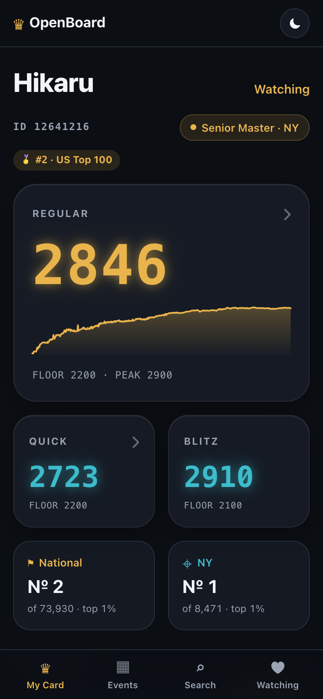
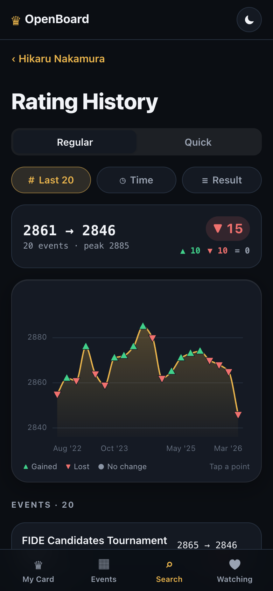
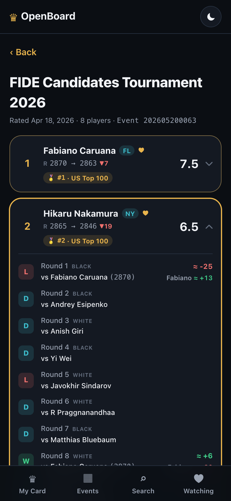
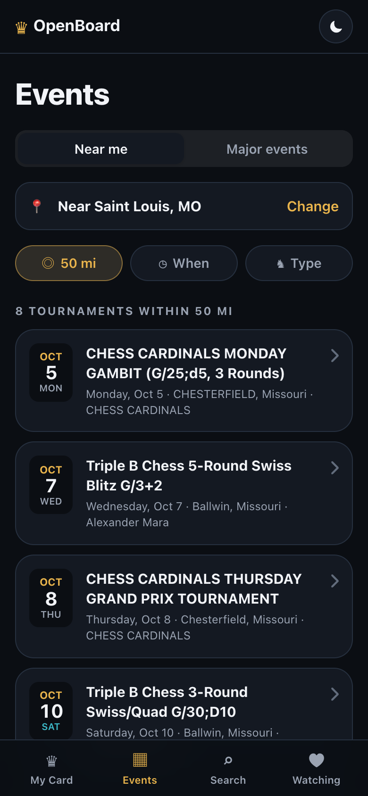
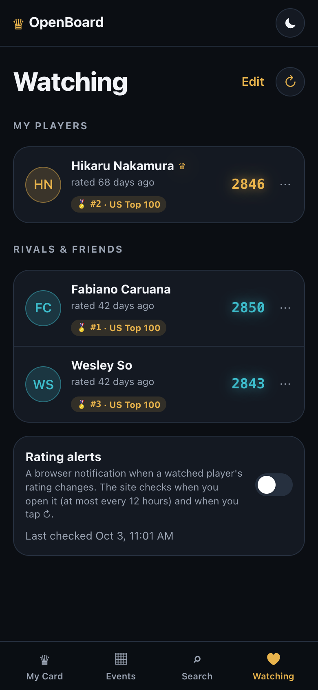
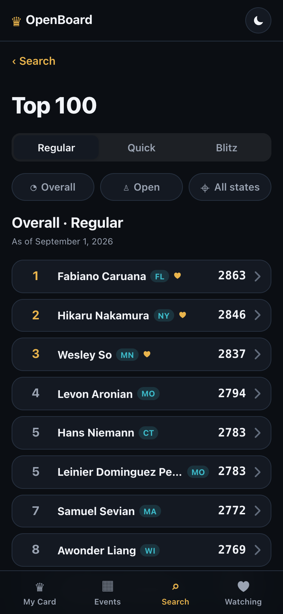
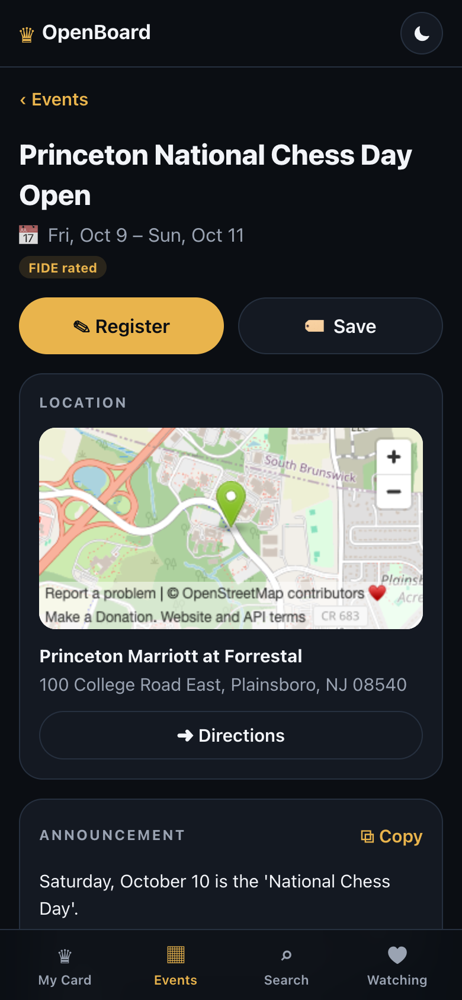
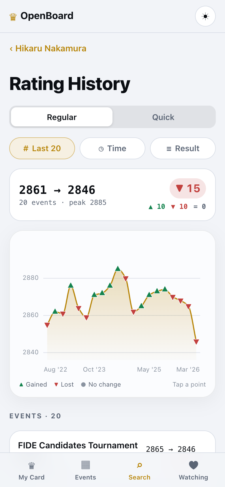

<h1 align="center">♛ OpenBoard Web</h1>

<p align="center">
  <strong>US Chess ratings and tournaments, made for families. In any browser.</strong><br>
  <em>The web version of <a href="https://github.com/ilia-pavlov/OpenBoard">OpenBoard for iPhone &amp; iPad</a>, on live US Chess data.</em><br>
  <a href="https://openboard-web.openboard-web.workers.dev"><strong>▶ Open OpenBoard Web</strong></a>
</p>

<p align="center">
  <a href="https://github.com/ilia-pavlov/OpenBoard-Web/actions/workflows/deploy.yml"></a>
</p>

<p align="center">
  
  
  
  
</p>

<p align="center">
  
  
  
  
</p>

---

## ♞ Why OpenBoard?

I built OpenBoard to help **parents find tournaments** for their kids, to let **kids
follow their friends and rivals** and **track their points**, and overall to help
**make chess more popular in the US**.

The official US Chess tools are built for organizers and are slow on phones. OpenBoard
puts what families actually check (the next tournament, the new rating, how a friend
did) one tap away.

## ✨ Features

- **♛ My Card**: your player's ratings as glowing chess-clock digits, with a rating
  sparkline, a "just rated" banner, national and state rank, and recent events.
- **📈 Rating History**: every rated event as a chart. A green ▲ means the rating went
  up, a red ▼ means it went down, and a gray ● means no change. Filter by Regular or
  Quick, number of events, time period, or result. Filters are kept in the URL, so you
  can bookmark or share a filtered view.
- **🏆 Crosstables**: every event row opens its crosstable at the right section, with the
  player outlined and expanded. Tap a player to see each round: the opponent, their
  rating, and an **estimated rating change for both players**. US Chess only publishes
  the event total, so the estimates are scaled to add up to it.
- **🥇 Best wins**: the highest-rated opponents a player has beaten in Regular play,
  **rated as they were on the day of the game**, and how far above the player that was.
- **🏅 Top 100 by age**: US Chess's monthly Top 100 lists (age 7 and under through 18,
  girls, 50+, 65+; Regular, Quick or Blitz; optionally just your state). Players on a
  list get a badge like **🏅 #37 · Age 9** everywhere they appear.
- **🗺️ Upcoming tournaments**: rated events near a city or ZIP (10 to 500 miles; this
  weekend, 30 days or 3 months; scholastic, quads or Grand Prix) plus nationwide major
  events. Each tournament shows its dates, a venue map with **Directions**, a
  **Register** button, **Save** for later, organizer contacts, and the full announcement
  as the organizer formatted it, with a **Copy** button that keeps each link's address.
- **❤️ Watching**: follow your kid, rivals and teammates with **♥ Watch** on any profile
  (the first player you watch becomes My Card). Turn on **rating alerts** to get a
  browser notification when a watched player's rating changes.
- **🔍 Search**: by name, 8-digit member ID, or 12-digit event ID.
- **🌗 Light and dark**: dark by default like the app, with Light and System modes.

<p align="center">
  
  
  
  
</p>

## 🚀 Run it

```sh
npm install
npm run dev        # http://localhost:5173
```

- `npm test` runs the unit tests (Vitest).
- `npm run build` typechecks the site and the Worker, and builds the site into `dist/`.
- `npm run preview:worker` runs the production setup locally (site + relay) with Wrangler.
- `npm run deploy` builds and deploys to Cloudflare Workers by hand.

Every push and pull request runs the tests and build in GitHub Actions
(`.github/workflows/deploy.yml`). A push to `main` that passes is deployed to
Cloudflare automatically, using the `CLOUDFLARE_API_TOKEN` and
`CLOUDFLARE_ACCOUNT_ID` repository secrets.

## 🔌 Why there's a relay

US Chess only lets browsers call `ratings-api.uschess.org` from its own site. The
server sends `Access-Control-Allow-Origin` only for `https://ratings.uschess.org`, and
`new.uschess.org` (tournament listings) sends no CORS headers at all. So the page calls
same-origin paths, and something on the server side forwards them:

| Page calls | Forwarded to |
|---|---|
| `/api/ratings/*` | `https://ratings-api.uschess.org/api/v1/*` |
| `/api/site/*` | `https://new.uschess.org/*` |

- **Development:** Vite's dev proxy (`vite.config.ts`).
- **Production:** a Cloudflare Worker (`worker/`, `wrangler.jsonc`). Static assets serve
  the site; the Worker runs only for `/api/*`. It:
  - forwards **only the paths the site uses** (anything else gets a 404, and only GET is
    allowed), so it isn't an open proxy;
  - keeps successful answers in Cloudflare's edge cache: minutes for profiles and
    searches, hours for finished events, Top 100 lists and the calendar. US Chess allows
    about 100 requests a minute per IP, and every visitor's request leaves through the
    relay, so the cache is what keeps a busy hour from rate-limiting everyone;
  - identifies itself to US Chess with a User-Agent that links to this repo.

  The site's responses carry a Content-Security-Policy and other security headers
  (`public/_headers`).

## 🗂️ Layout

| File | What it holds |
|---|---|
| `src/endpoints.ts` | US Chess paths, query parameters and HTML patterns. Mirrors the app's `Shared/USChessEndpoints.swift`. |
| `src/models.ts` | API wire types and their mapping to domain models. Port of `USCFAPITypes.swift`. |
| `src/api.ts` | Fetching: paging, request de-duplication, and waiting out rate limits (429). |
| `src/router.ts` | Hash router. Each screen gets a signal that aborts when you navigate away. |
| `src/chart.ts` | The Rating History chart (SVG, hover, tap, and arrow keys). |
| `src/estimator.ts` | Per-round rating estimates. Port of `RoundRatingEstimator.swift`. |
| `src/bestwins.ts` | Best wins ranking and the paced, resumable scan. Port of `BestWins` and `bestWinsScan`. |
| `src/toplists.ts` | Which Top 100 lists each player is on, and the badges. Port of `TopListsIndex.swift`. |
| `src/tournaments.ts` | Upcoming tournaments: listings, announcements and the Plan Ahead Calendar. Port of `TournamentsService.swift`. |
| `src/announcement.ts` | Makes an organizer's announcement HTML safe to show (allowlist) and builds the Copy text. |
| `src/watchlist.ts` | Checks watched players for rating changes and sends alerts. Port of `RefreshScheduler.swift`. |
| `src/location.ts` | "Use my location" and distances. |
| `src/store.ts` | IndexedDB cache for data worth keeping across visits. |
| `worker/` | The Cloudflare Worker: the relay's path rules and cache lifetimes (`relay.ts`) and the handler (`index.ts`). |
| `src/views/` | One file per screen: My Card and profiles, Search, Rating History, Crosstable, Best wins, Top 100, Events, Tournament, Watching, About. |

## 🌍 Other services

- **OpenStreetMap** draws the venue map on a tournament page (it needs WebGL), and its
  Nominatim service turns your location into a city, only when you tap "Use my
  location". The US Chess search accepts a city or ZIP but ignores coordinates.
- **Directions** open Apple Maps on Apple devices and Google Maps elsewhere.
- Everything you choose (watched players, saved tournaments, location, settings) stays
  in your browser. There are no accounts and no analytics.

> **Data sources:** ratings come from US Chess's **MUIR** platform; upcoming tournaments
> come from US Chess's **Tournament Life Announcements** and **Plan Ahead Calendar** on
> [new.uschess.org](https://new.uschess.org/upcoming-tournaments). The ratings API isn't
> officially documented, so responses can change without notice.
>
> *Not affiliated with or endorsed by the US Chess Federation.*
